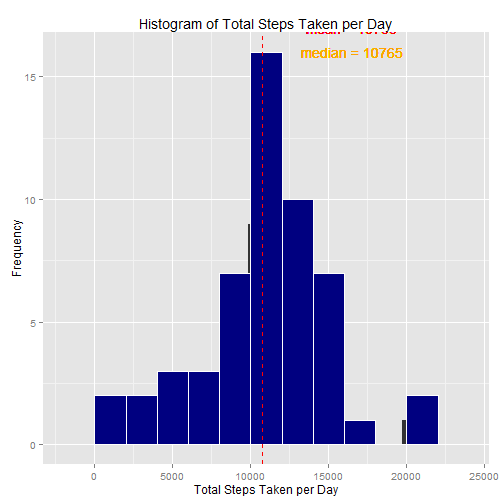
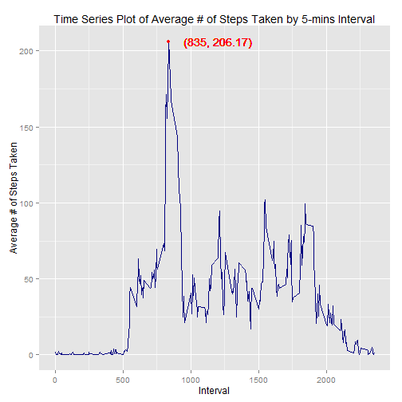
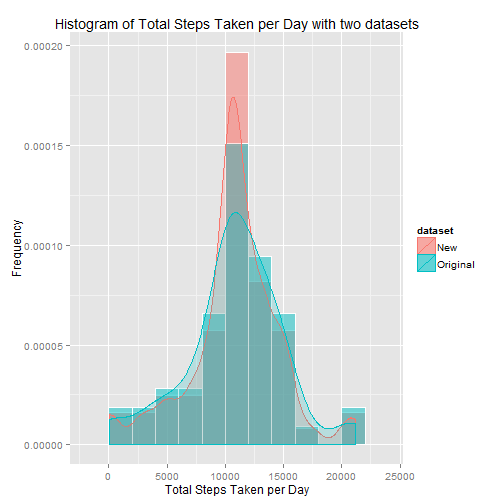
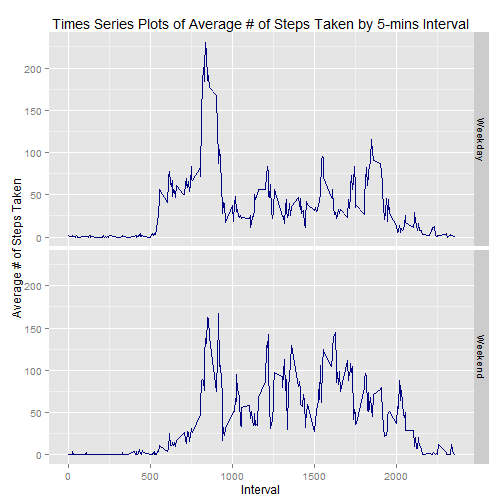

### Loading and preprocessing the data
1. Load the dataset from data source.

```r
#set up working directory.
wd = "C://Users/u213493/Desktop/Data_Science/Reproducible_Research"
setwd(wd)                                          

#check if the file exists.
url = "https://d396qusza40orc.cloudfront.net/repdata%2Fdata%2Factivity.zip"
if (!file.exists("activity.csv")) {
        if (!file.exists("repdata_data_activity.zip")) {
                download.file(url, destfile = wd)
        }
        unzip("repdata_data_activity.zip")         
}
#read data saved in working directory.
data = read.csv("activity.csv", header = TRUE)     

#remove all NAs in the data frame.
cdata = data[!is.na(data$steps), ]               
```
2. Check the summaries of raw and processed datasets.

```r
summary(data)                                      #look at the summary of raw dataset.
```

```
##      steps                date          interval     
##  Min.   :  0.00   2012-10-01:  288   Min.   :   0.0  
##  1st Qu.:  0.00   2012-10-02:  288   1st Qu.: 588.8  
##  Median :  0.00   2012-10-03:  288   Median :1177.5  
##  Mean   : 37.38   2012-10-04:  288   Mean   :1177.5  
##  3rd Qu.: 12.00   2012-10-05:  288   3rd Qu.:1766.2  
##  Max.   :806.00   2012-10-06:  288   Max.   :2355.0  
##  NA's   :2304     (Other)   :15840
```

```r
summary(cdata)                                     #look at the summary of processed dataset.
```

```
##      steps                date          interval     
##  Min.   :  0.00   2012-10-02:  288   Min.   :   0.0  
##  1st Qu.:  0.00   2012-10-03:  288   1st Qu.: 588.8  
##  Median :  0.00   2012-10-04:  288   Median :1177.5  
##  Mean   : 37.38   2012-10-05:  288   Mean   :1177.5  
##  3rd Qu.: 12.00   2012-10-06:  288   3rd Qu.:1766.2  
##  Max.   :806.00   2012-10-07:  288   Max.   :2355.0  
##                   (Other)   :13536
```

### What is mean total number of steps taken per day?
1. Plot the histogram of total steps taken per day.

```r
suppressMessages(library(dplyr)); library(ggplot2) #load dplyr and ggplot2 packages.
group_day = group_by(cdata, date)                  #group the data by date.
Summary = summarize(group_day, sum(steps))         #calculate the sum of steps in each day.

#plot histogram of total steps taken per day.
q = qplot(`sum(steps)`, data = Summary, main = "Histogram of Total Steps Taken per Day") + 
        geom_histogram(colour = "white", fill = "navy", binwidth = 2000) + 
        ylab("Frequency") + 
        xlab("Total Steps Taken per Day") +
        geom_vline(xintercept = 10766, colour = "red", linetype = "dashed") +
        geom_text(label = "mean = 10766", x = 16500, y = 17, colour = "red") +
        geom_text(label = "median = 10765", x = 16500, y = 16, colour = "orange")
suppressMessages(print(q))
```

 

2. Calculate the mean and median of the total steps.

```r
summary(Summary)
```

```
##          date      sum(steps)   
##  2012-10-02: 1   Min.   :   41  
##  2012-10-03: 1   1st Qu.: 8841  
##  2012-10-04: 1   Median :10765  
##  2012-10-05: 1   Mean   :10766  
##  2012-10-06: 1   3rd Qu.:13294  
##  2012-10-07: 1   Max.   :21194  
##  (Other)   :47
```

### What is the average daily activity pattern?
1. Plot the time series plot of average steps taken by 5-mins interval.

```r
group_int = group_by(cdata, interval)
Summary1 = summarize(group_int, mean(steps))

#plot time series plot of average # of steps taken by 5-mins interval.
q1 = ggplot(data = Summary1, aes(x = interval, y = `mean(steps)`)) + 
        geom_line(colour = "navy") +
        ylab("Average # of Steps Taken") +
        xlab("Interval") +
        ggtitle("Time Series Plot of Average # of Steps Taken by 5-mins Interval") +
        geom_point(aes(x = 835, y = 206.17), colour = "red", size = 2) +
        geom_text(label = "(835, 206.17)", x = 1200, y = 206.17, colour = "red")
print(q1)
```

 

```r
print(paste("The interval that contains the maximum average steps is", Summary1[which.max(Summary1$`mean(steps)`), ]$interval))    #get the 5-min interval with maxium # of steps.
```

```
## [1] "The interval that contains the maximum average steps is 835"
```

### Imputing missing values.
1. Count the # of missing values in the raw dataset.

```r
print(paste("The # of rows that contain missing values in the dataset is", (sum(is.na(data$steps)))))
```

```
## [1] "The # of rows that contain missing values in the dataset is 2304"
```
2. Replace the missing values with average steps taken by intervals.

```r
#get the index from the column of interval.
interval = Summary1$interval                       

#create a function that extracts the average # by intervals.
extract_mean = function(x) return(Summary1[Summary1$interval == x, ]$`mean(steps)`) 

#create a function that gets the index with conditions of steps == NA & each time interval.
data1 = data #create another dataset for this process so that raw dataset will not be changed.
na_index = function(y) return(which(is.na(data1$steps) & data1$interval == y)) 

#replace all NAs with average # of steps by each interval.
for (i in interval) data1[na_index(i), ]$steps = extract_mean(i)
```
3. Check the summary of new dataset that has missing values replaced.

```r
summary(data1)     #look at summary of the dataset with NA replaced by average steps by each interval.
```

```
##      steps                date          interval     
##  Min.   :  0.00   2012-10-01:  288   Min.   :   0.0  
##  1st Qu.:  0.00   2012-10-02:  288   1st Qu.: 588.8  
##  Median :  0.00   2012-10-03:  288   Median :1177.5  
##  Mean   : 37.38   2012-10-04:  288   Mean   :1177.5  
##  3rd Qu.: 27.00   2012-10-05:  288   3rd Qu.:1766.2  
##  Max.   :806.00   2012-10-06:  288   Max.   :2355.0  
##                   (Other)   :15840
```
4. Plot the histograms of original and new datasets.

```r
#plot the histograms with two datasets.
group_day1 = group_by(data1, date)
Summary2 = summarize(group_day1, sum(steps))

#add a new column to specify original and new datasets. 
Summary$dataset = "Original"; Summary2$dataset = "New" 

#combine two original and new datasets into one.
newSummary = rbind(Summary, Summary2)             

#renames the column names.
colnames(newSummary) = c("date", "total_steps", "dataset") 

q2 = ggplot(data = newSummary, aes(x = total_steps, fill = dataset, colour = dataset)) + 
        geom_histogram(aes(y = ..density..), colour = "white", binwidth = 2000, alpha = 0.5, position = "identity") +
        geom_density(alpha = 0.2) +
        ylab("Frequency") +
        xlab("Total Steps Taken per Day") +
        ggtitle("Histogram of Total Steps Taken per Day with two datasets")
print(q2)
```

 

5. Calculate and compare means and medians from original and new datasets.

```r
df = group_by(newSummary, dataset)
summarize(df, mean(total_steps), median(total_steps))
```

```
## Source: local data frame [2 x 3]
## 
##    dataset mean(total_steps) median(total_steps)
##      (chr)             (dbl)               (dbl)
## 1      New          10766.19            10766.19
## 2 Original          10766.19            10765.00
```

### Are there differences in activity patterns between weekdays and weekends?
1. Create a new factor variable in the dataset with two levels of weekday and weekend. 

```r
#transform date to weekdays.
data1$day = weekdays(as.Date(data1$date), abbreviate = T)

#create another variable that contains 2 levels of weekday and weekend.
data1[data1$day == "Mon" | data1$day == "Tue" | data1$day == "Wed" | data1$day == "Thu" | data1$day == "Fri", ]$day = "Weekday"
data1[data1$day == "Sat" | data1$day == "Sun", ]$day = "Weekend"
data1$day = as.factor(data1$day)
str(data1)
```

```
## 'data.frame':	17568 obs. of  4 variables:
##  $ steps   : num  1.717 0.3396 0.1321 0.1509 0.0755 ...
##  $ date    : Factor w/ 61 levels "2012-10-01","2012-10-02",..: 1 1 1 1 1 1 1 1 1 1 ...
##  $ interval: int  0 5 10 15 20 25 30 35 40 45 ...
##  $ day     : Factor w/ 2 levels "Weekday","Weekend": 1 1 1 1 1 1 1 1 1 1 ...
```
2. Plot the time series plots with x = interval and y = average steps by weekday and weekend.

```r
#group data by interval and weekday and calculate the mean.
Summary3 = summarize(group_by(data1, interval, day), mean(steps)) 

#plot time series plots of weekday and weekend by interval.
q3 = ggplot(data = Summary3, aes(x = interval, y = `mean(steps)`)) +
        geom_line(colour = "navy") +
        facet_grid(day ~ .) +
        ylab("Average # of Steps Taken") +
        xlab("Interval") +
        ggtitle("Times Series Plots of Average # of Steps Taken by 5-mins Interval")
print(q3)
```

 
